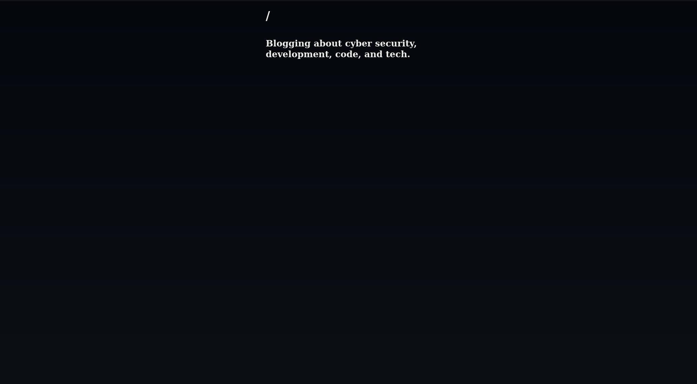

# wasmdash

---


[](https://goreportcard.com/report/github.com/pynezz/wasmdash)


Simple dashboard PWA full-stack application built with Go compiled with TinyGo to WebAssembly.

## Features

- Basic CRUD operations
- Localhost API for editing
- Responsive design for mobile and desktop
- Easy to use and customize

## Architecture

- Frontend: (undecided)
- Backend: Go
- Database: IndexedDB
- Storage: LocalStorage
- Cache: Service Worker
- CDN: Service Worker

## Installation

**Step 1:** Clone the repository

### Dependencies

#### The container way

- Podman / Docker

##### Containerfile

```Containerfile
FROM tinygo/tinygo:0.37.0

WORKDIR /app

COPY . .

RUN tinygo build -o wasmdash.wasm main.go

CMD ["tinygo", "build", "-o", "wasmdash.wasm", "main.go"]
```

This will build the WebAssembly binary, you then need to extract it from the container.

##### Manually

```bash
podman pull tinygo/tinygo:0.37.0
```

**Build and extract binary:**
```bash
podman run --rm -v $(pwd):/app tinygo/tinygo:0.37.0 tinygo build -o wasmdash.wasm main.go
```

#### The binary way

- Go
- TinyGo

## Screenshots

> [!IMPORTANT]
> Heavily work in progress screenshot



## Contributing

[Contributing](CONTRIBUTING.md)

### Dependencies

**templ**

```sh
go install github.com/a-h/templ/cmd/templ@latest
```

**tailwindcss**

```sh
curl -sLO https://github.com/tailwindlabs/tailwindcss/releases/latest/download/tailwindcss-linux-x64
chmod +x tailwindcss-linux-x64
sudo mv tailwindcss-linux-x64 /usr/local/bin/tailwindcss
```

**templui**

```sh
go install github.com/axzilla/templui/cmd/templui@latest
```

**air**

```sh
go install github.com/air-verse/air@latest
```

**start development server**

```
make dev
```

## License

[MIT](LICENSE)
