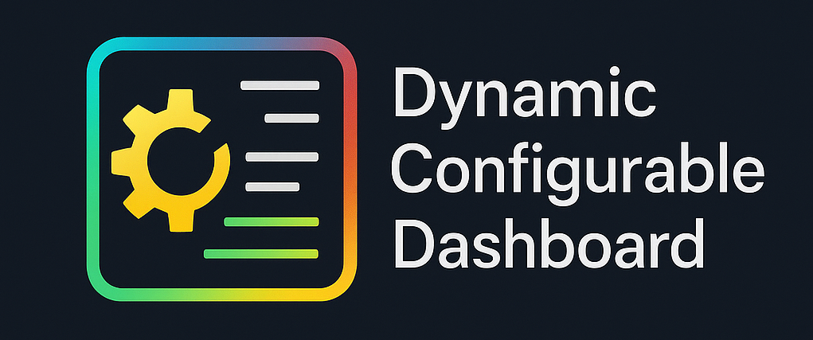
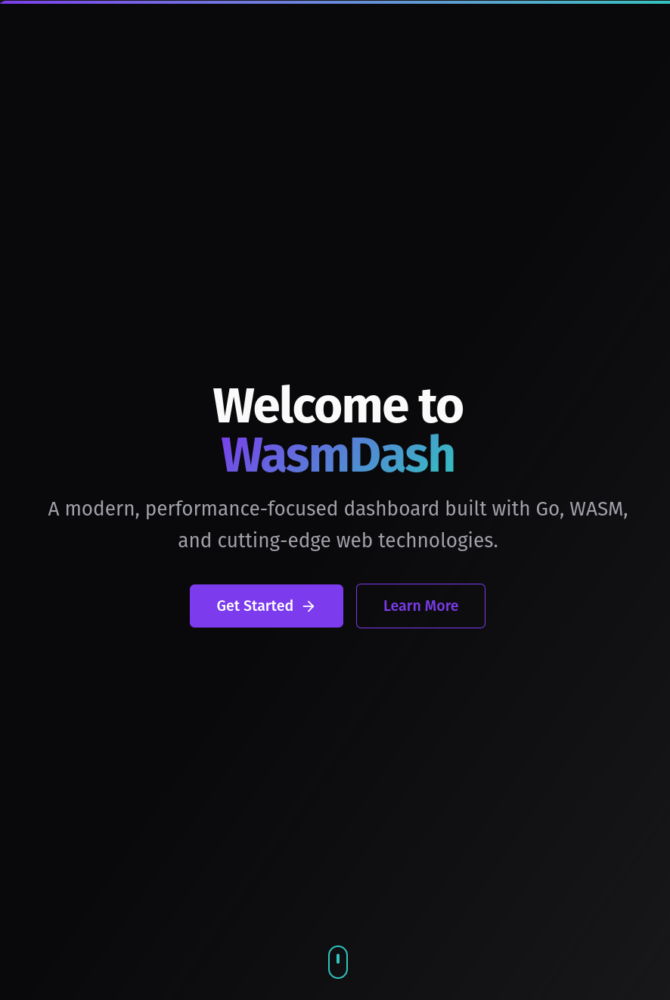

# wasmdash
<!-- DatDash? -->
<!-- webassembly Digital App Services Home? -->

A self-hosted aesthetically pleasing, hackable, no bullshit dashboard in a single file.

No tracking, no premium features, no bullshit, just a simple dashboard.

---



 [](https://goreportcard.com/report/github.com/pynezz/wasmdash)  


---

## Table of contents

- [Features](#features)
- [Architecture](#architecture)
- [Installation](#installation)
- [Contributing](#contributing)
- [License](#license)

## Features

### Web app

- [ ] Basic CRUD operations
- [ ] Localhost API for editing
- [x] Responsive design for mobile and desktop
- [ ] Easy to use and customize
  - [ ] Widgets
  - [ ] Custom API
- [ ] Dynamic layout
- [ ] Theming

### Backend

- [ ] Basic CRUD operations
- [ ] Secrets management
- [ ] Simple API
- [ ] Simple auth middleware

> [!CAUTION]
> Simple auth should not be relied upon by itself

## Architecture

- Frontend: [Templ](https://templ.guide), [TemplUI](https://templui.io), TailwindCSS, and undecided [*[Datastar](https://data-star.dev) or [Alpine.js](https://alpinejs.dev)*]
- Backend: Go
- Database: Undecided [*IndexedDB, SQLite*]
- Storage: LocalStorage
- Cache: Service Worker
- CDN: Service Worker

## Installation

**Step 1:** Clone the repository

### Dependencies

#### The container way

- Podman / Docker

##### Containerfile

```Containerfile
FROM tinygo/tinygo:0.37.0

WORKDIR /app

COPY . .

RUN tinygo build -o wasmdash.wasm main.go

CMD ["tinygo", "build", "-o", "wasmdash.wasm", "main.go"]
```

This will build the WebAssembly binary, you then need to extract it from the container.

##### Manually

```bash
podman pull tinygo/tinygo:0.37.0
```

**Build and extract binary:**
```bash
podman run --rm -v $(pwd):/app tinygo/tinygo:0.37.0 tinygo build -o wasmdash.wasm main.go
```

#### The binary way

- Go
- TinyGo

## Screenshots

> [!IMPORTANT]
> Heavily work in progress screenshot

**08.06.2025**



**03.06.2025**

> 

## Contributing

[Contributing](CONTRIBUTING.md)

### Dependencies

**templ**

```sh
go install github.com/a-h/templ/cmd/templ@latest
```

**tailwindcss**

```sh
curl -sLO https://github.com/tailwindlabs/tailwindcss/releases/latest/download/tailwindcss-linux-x64
chmod +x tailwindcss-linux-x64
sudo mv tailwindcss-linux-x64 /usr/local/bin/tailwindcss
```

**templui**

```sh
go install github.com/axzilla/templui/cmd/templui@latest
```

**air**

```sh
go install github.com/air-verse/air@latest
```

**start development server**

```
make dev
```

## License

[MIT](LICENSE)
